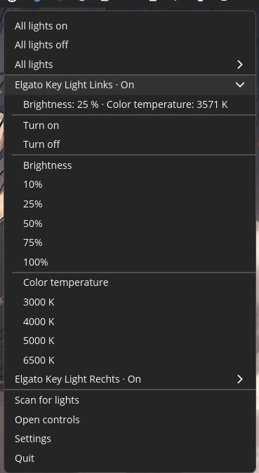

<div align="center">
  
  <h1>Keylight Commander Linux</h1>
  <p><strong>Elgato Key Lights direkt über die Linux-Taskleiste steuern.</strong></p>
  <p>Lokale, schnelle und cloudfreie Steuerung für Ubuntu, Pop!_OS, COSMIC und Wayland.</p>
  <p><a href="README.md">English</a> · <a href="#installation">Installation</a> · <a href="#funktionen">Funktionen</a> · <a href="https://github.com/Avacon00/elgatokeylight-commander-linux/issues/new/choose">Fehler melden</a></p>
</div>

---

**Keylight Commander Linux** steuert ein oder mehrere Elgato Key Lights über das lokale Netzwerk. Die App findet Lampen per mDNS und verwendet anschließend direkt deren lokale HTTP-Schnittstelle. Ein Cloud-Konto oder externer Server ist nicht erforderlich.

Die App ist für **Pop!_OS 24.04 mit COSMIC unter Wayland** optimiert und wird auch unter **Ubuntu 24.04** gebaut und getestet. Andere Linux-Distributionen und Desktopumgebungen wurden bisher nicht geprüft. Erfahrungs- und Fehlerberichte sind ausdrücklich willkommen.

## Screenshot

<p align="center">
  
</p>

## Installation

Das aktuelle **amd64-DEB** unter [GitHub Releases](https://github.com/Avacon00/elgatokeylight-commander-linux/releases/latest) herunterladen und installieren:

```sh
sudo apt install ./keylight-commander-linux_0.2.4_amd64.deb
```

Danach **Keylight Commander Linux** über das Anwendungsmenü starten. Beim ersten Start öffnet sich das Steuerfenster, die App sucht im lokalen Netzwerk nach Lampen und richtet den Autostart ein. Die Key Lights müssen bereits mit demselben Netzwerk verbunden sein.

Vor einem Update die laufende App über **Beenden** im Tray-Menü schließen. Gespeicherte Lampen und Einstellungen bleiben erhalten.

## Funktionen

### Steuerung im Linux-Panel

- Dauerhaftes Lampensymbol im COSMIC-Statusbereich über AppIndicator/StatusNotifierItem.
- Alle erreichbaren Lampen gemeinsam ein- oder ausschalten.
- Eine einzelne ausgewählte Lampe unabhängig steuern.
- Helligkeitswerte: **10, 25, 50, 75 und 100 %**.
- Farbtemperaturen: **3000, 4000, 5000 und 6500 K**.
- Aktueller Zustand, Helligkeit und Farbtemperatur jeder erreichbaren Lampe.
- Offline-Lampen bleiben sichtbar; ihre Aktionen sind deaktiviert und alte Messwerte werden nicht als aktuell angezeigt.
- Lampensuche, Steuerfenster, Einstellungen und Beenden direkt im Panel-Menü.

### Genaues Steuerfenster

- Stufenlose Helligkeit von **3 bis 100 %**.
- Stufenlose Farbtemperatur von ungefähr **2900 bis 7000 K**.
- Optionale Synchronisierung der Fensterregler für alle erreichbaren Lampen.
- Lampen umbenennen sowie Modell, Seriennummer, Firmware, MAC-Adresse und Netzwerkziel ansehen.
- Identifikationsblinken mit zuverlässiger Wiederherstellung des vorherigen bestätigten Zustands.

### Suche und Zuverlässigkeit

- Automatische lokale Erkennung per mDNS einschließlich Adresse und Port.
- Wiedererkennung anhand Seriennummer, ersatzweise MAC-Adresse; geänderte IP-Adressen werden übernommen.
- Weitere Suchläufe ergänzen und aktualisieren Geräte, ohne Offline-Lampen zu löschen.
- Befehle werden je Lampe serialisiert; schnelle Reglerbewegungen werden zusammengefasst.
- HTTP-Status, Zeitüberschreitungen und tatsächlicher Gerätezustand werden geprüft.
- Gruppenaktionen melden Teilausfälle und zeigen keinen unbestätigten Erfolg.
- Aktualisierung ungefähr alle 2 Sekunden bei sichtbarem Fenster und alle 10 Sekunden im Hintergrund.

### Desktopintegration und Sprache

- Hintergrundbetrieb nach dem Schließen des Fensters.
- Abschaltbarer Autostart nach der Anmeldung.
- Ein erneuter Programmstart öffnet die vorhandene Instanz.
- Ohne kompatiblen Tray-Host bleibt das sichtbare Fenster als Rückfall verfügbar.
- Eigene App-Identität und Konfiguration getrennt vom ursprünglichen Projekt.
- Deutsche und englische Oberfläche; Systemsprache oder manuelle Auswahl ohne Neustart.

## Getestete Systeme

| System | Stand |
| :--- | :--- |
| **Pop!_OS 24.04 · COSMIC · Wayland · amd64** | Tray, Fenster, Hintergrundbetrieb und DEB lokal geprüft |
| **Ubuntu 24.04 · amd64** | Build, automatisierte Tests und DEB-Paketierung abgedeckt |
| Andere Linux-Distributionen/Desktopumgebungen | Noch ungeprüft; AppIndicator- und WebKitGTK-Unterstützung kann abweichen |
| Windows / macOS | Quellcode-Kompatibilität bleibt erhalten, Laufzeitverhalten ist ungeprüft |

Du hast eine andere Distribution, Desktopumgebung oder ein weiteres Key-Light-Modell getestet? Dann bitte einen [GitHub-Issue öffnen](https://github.com/Avacon00/elgatokeylight-commander-linux/issues/new/choose). Distribution, Desktop/Sitzung, App-Version, Lampenmodell und nachvollziehbare Schritte angeben. Meldungen auf **Deutsch oder Englisch** sind willkommen.

## Entwicklung und Prüfung

Die [Entwicklungsanleitung](docs/DEVELOPMENT.md) enthält Abhängigkeiten, Build-Befehle, Architektur und den nativen COSMIC-Integrationstest. Ausführliche Ergebnisse und noch offene Hardwareprüfungen stehen in [TESTING.md](TESTING.md).

Version 0.2.4 besteht 18 Rust-Tests, 6 Frontend-/Übersetzungstests, TypeScript, Clippy, Produktions-Builds und native Menütests auf Deutsch und Englisch mit isolierten simulierten Lampen.

## Herkunft und Lizenz

Dieses Projekt ist eine eigenständige, auf Linux ausgerichtete Weiterentwicklung von [David Chalifoux' Keylight Commander](https://github.com/davidchalifoux/keylight-commander), ausgehend von Upstream-Commit [`5aec930`](https://github.com/davidchalifoux/keylight-commander/commit/5aec9305b6dc3a989a81c66ebc2692070462e426) (v0.1.1).

Die ursprüngliche Git-Historie, Urheberhinweise und [MIT-Lizenz](license.md) bleiben erhalten.
